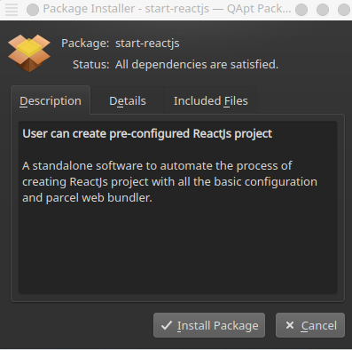

 start-reactjs

 

## Introduction  
Start ReactJs is a standalone cross-platform desktop GUI software, which automates the process of initializing preconfigured ReactJs project without any hustle.

## Need for this application
This application has been developed to overcome the limitations and disadvantages of well-known app initialization command `npx create-react-app`.

#### Disadvantages of using CRA command
- Difficult to add custom build configs. One way to add custom configs is to eject the app, but then it overrides the _Only one build dependency advantage_.
- Abstracts everything. It's important to understand the things that need to run a React app. But due to its _Only one build dependency advantage_, a beginner might think that react-scripts is the only dependency needed to run react apps and might not know that transpiler(babel), bundler(webpack) are the key dependencies which are used under the hood by react-scripts.
- It uses Webpack web-bundler under the hood, but there are more efficient web bundlers available like a parcel. Which is super quick and lightweight.
- App initialization(creation) process takes more than the usual time.

Hence, general-purpose and lightweight initialization tool is required to create React Js app.

## Features of this application
1. Cross-platform and lightweight application available for almost all versions of Linux(Ubuntu, kali, etc.) and windows. It is built with Python3 and Tkinter.
2. Your preconfigured React Js project is just a click away.
3. Fully customizable. The generated project will have config files like .eslintrc, .prettierrc, etc. One only needs to change these configs according to his/her needs if required.
4. It uses parcel web bundler and also all the scripts are already added in the packge.json file. One only need to hit following commands,
    * `npm run format` - It activates the prettier and formates whole source code according to configs specified in .prettierrc file. Which is useful to maintain a uniform coding style while working in a team.
    * `npm run lint` - It activates the ESlint and displays the all possible bugs and inconsistency in code according to configs specified in eslintrc file.
    * `npm run lint -- --fix` - This command automatically makes code consistency and removes auto fixable bugs.
    * `npm run dev` - It starts the development server.

## Installation
Get the suitable application package from [start-reactjs](https://spzala19.github.io/start-reactjs/)
  
#### Installation steps for Windows users
1. Download the zip from the above link and extract it to your target directory.
2. Click on 'start-reactjs.exe' and start building cool stuff.

 
#### Installation steps for Linux users
1. Download the DEB binary from the above link.
2. Simply,  double click on that binary file and install it. Once the installation has been completed, the application icon will appear on your start menu.

   
  
## Usage
Enter the project name and description then click on the start button. That's it!

  
[View video here](https://youtu.be/osU_6H2AfPQ)

  
## Contribution guidelines
Pull requests are welcome. For major changes, please open an issue first to discuss what you would like to change. More functionalities can be added.
  
